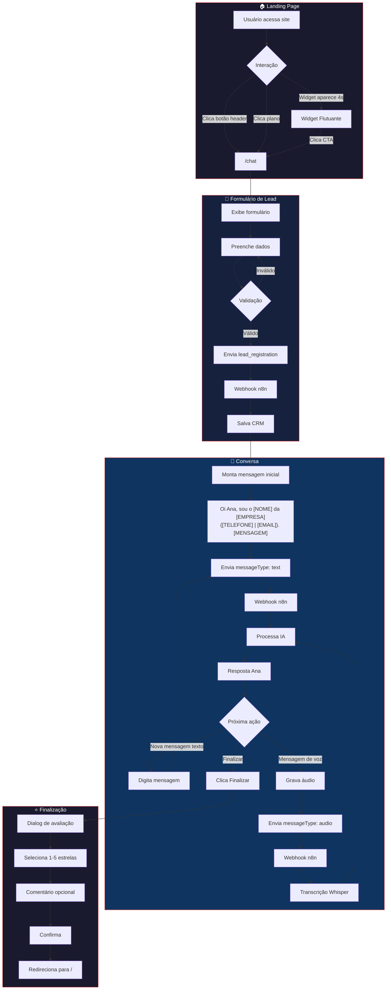
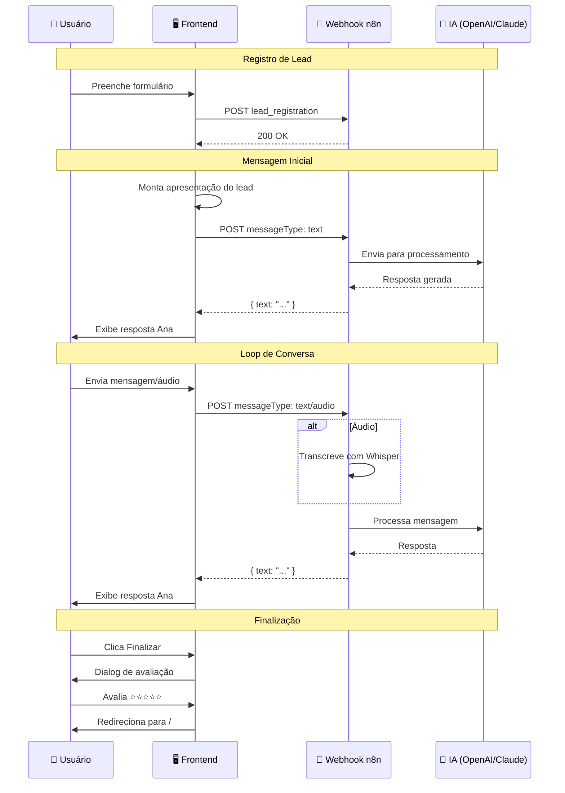

# DeckSoft - Landing Page & Sistema de Chat Inteligente

Sistema completo de landing page com chatbot inteligente integrado via n8n para a DeckSoft, empresa de soluções ERP para diversos segmentos.

## 📋 Índice

- [Visão Geral](#visão-geral)
- [Funcionalidades](#funcionalidades)
- [Tecnologias](#tecnologias)
- [Estrutura do Projeto](#estrutura-do-projeto)
- [Integração n8n](#integração-n8n)
- [Páginas e Rotas](#páginas-e-rotas)
- [Componentes Principais](#componentes-principais)
- [Configuração](#configuração)
- [Deploy](#deploy)

---

## 🎯 Visão Geral

A DeckSoft oferece soluções de ERP especializadas para três segmentos principais:

- **Materiais de Construção** - Gestão completa para depósitos, home centers e lojas especializadas
- **Agronegócios** - Soluções para revendas, cooperativas e distribuidoras
- **Combustíveis** - Sistema especializado para postos e distribuidoras

O projeto consiste em uma landing page moderna e responsiva com um sistema de chat inteligente alimentado por IA através de integração com n8n.

---

## ✨ Funcionalidades

### Landing Page

- **Hero Section Dinâmica**: Background e mensagens mudam conforme o hover nos cards de módulos
- **Animações de Scroll**: Elementos animam ao entrar na viewport
- **Seção de Estatísticas**: Contadores animados (500+ empresas, 27 estados, 15+ anos, 98% satisfação)
- **Carrossel de Parceiros**: 24 logos de parceiros em scroll infinito
- **Depoimentos**: 20 testimonials em duas linhas com scroll automático
- **Planos de Preços**: Toggle mensal/anual com economia de até 20%
- **FAQ Interativo**: Accordion com perguntas frequentes
- **Footer Completo**: Links, informações de contato e redes sociais

### Sistema de Chat (Ana - Atendente Virtual)

#### Formulário de Lead
- Captura nome, e-mail, telefone, empresa e mensagem inicial (opcional)
- Validação de e-mail e formatação automática de telefone (XX XXXXX-XXXX)
- Campo de mensagem opcional para o lead descrever sua necessidade

#### Mensagem Inicial Automática
Ao iniciar o chat, o sistema envia automaticamente uma mensagem de apresentação que inclui:
- Nome do lead
- Empresa (se informada)
- Telefone
- E-mail

**Formato da mensagem:**
```
Oi Ana, tudo bem? Sou o [NOME] da [EMPRESA] ([TELEFONE] | [EMAIL]). [MENSAGEM DO LEAD]
```

Se o lead não escrever uma mensagem personalizada, o sistema usa:
```
Oi Ana, tudo bem? Sou o [NOME] da [EMPRESA] ([TELEFONE] | [EMAIL]), gostaria de mais informações sobre os serviços de vocês.
```

#### Chat em Tempo Real
- Interface estilo WhatsApp com mensagens do usuário e da Ana
- Indicador de digitação ("Ana está digitando...") com avatar animado
- Status de mensagem (enviado ✓ / lido ✓✓)
- Scroll automático para última mensagem
- Envio de múltiplas mensagens sem bloqueio
- Foco automático no input após resposta

#### Mensagens de Voz
- Gravação de áudio via botão de microfone
- Waveform animado durante gravação
- Player de áudio interativo com:
  - Botão play/pause
  - Waveform visual com barras coloridas
  - Indicador de progresso (parte tocada vs não tocada)
  - Tempo atual / duração total
  - Seek por clique nas barras do waveform
- Duração capturada no momento da gravação (sem delay)

#### Finalização do Chat
- Botão "Finalizar chat" ao lado do input
- Dialog de avaliação com:
  - Rating de 1-5 estrelas (obrigatório)
  - Campo de comentário opcional
  - Botão desabilitado até selecionar estrelas
- Redirecionamento para landing page após finalizar

#### Integração n8n
- Webhook para processamento de mensagens via IA
- Suporte a mensagens de texto e áudio
- Timestamps em horário de Brasília (UTC-3)
- Dados do lead enviados em todas as mensagens

### Widget Flutuante

- **Aparece Automaticamente**: Após 4 segundos na landing page
- **Mensagens Sequenciais**: 3 mensagens de boas-vindas com delays de 2s
- **Indicador de Digitação**: Aparece antes de cada mensagem
- **Expansível/Retrátil**: Pode ser minimizado sem perder o contexto
- **CTA para Chat**: Direciona para a página de chat completa

### Sistema de Login

- **Login Social**: Botões para Google, Microsoft e Apple (UI pronta)
- **Login com E-mail**: Formulário de e-mail e senha
- **Recuperação de Senha**: Página dedicada com confirmação visual
- **Design Responsivo**: Funciona em desktop e mobile

---

## 📊 Diagrama do Fluxo de Conversa



### Fluxo Simplificado de Mensagens



---


### Frontend
- **React 18** - Biblioteca UI
- **TypeScript** - Tipagem estática
- **Vite** - Build tool
- **Tailwind CSS** - Estilização utility-first
- **Shadcn/ui** - Componentes UI

### Bibliotecas
- **React Router DOM** - Roteamento SPA
- **Lucide React** - Ícones
- **React Query** - Gerenciamento de estado assíncrono
- **Sonner** - Notificações toast
- **Class Variance Authority** - Variantes de componentes

### Integrações
- **n8n** - Automação e processamento de chat via webhook
- **Google Analytics** - Tracking (G-D99XWC36R3)

---

## 📁 Estrutura do Projeto

```
src/
├── assets/                    # Imagens e recursos
│   ├── partners/             # Logos de parceiros (24 logos)
│   ├── testimonials/         # Fotos de usuários (20 fotos)
│   ├── hero-bg-*.jpg         # Backgrounds do hero
│   ├── logo-*.png            # Variações do logo
│   └── chat-avatar.jpg       # Avatar da Ana
│
├── components/               # Componentes React
│   ├── ui/                   # Componentes Shadcn/ui
│   ├── AnimatedSection.tsx   # Wrapper para animações de scroll
│   ├── AudioPlayer.tsx       # Player de áudio com waveform
│   ├── AudioWaveform.tsx     # Visualização de waveform na gravação
│   ├── FAQSection.tsx        # Seção de perguntas frequentes
│   ├── FloatingChatWidget.tsx # Widget de chat flutuante
│   ├── Footer.tsx            # Rodapé
│   ├── FullScreenChat.tsx    # Chat em tela cheia (modal)
│   ├── Header.tsx            # Cabeçalho com navegação
│   ├── Logo.tsx              # Componente do logo
│   ├── ModuleCard.tsx        # Cards dos módulos ERP
│   ├── PartnersSection.tsx   # Carrossel de parceiros
│   ├── PricingSection.tsx    # Planos e preços
│   ├── StatsSection.tsx      # Estatísticas animadas
│   └── TestimonialsSection.tsx # Depoimentos
│
├── hooks/                    # Hooks customizados
│   ├── use-audio-recorder.ts # Hook para gravação de áudio
│   ├── use-count-up.ts       # Contador animado
│   ├── use-in-view.ts        # Detecção de viewport
│   ├── use-mobile.tsx        # Detecção de mobile
│   └── use-toast.ts          # Sistema de toasts
│
├── pages/                    # Páginas/Rotas
│   ├── Index.tsx             # Landing page principal
│   ├── Chat.tsx              # Página de chat completa
│   ├── Login.tsx             # Página de login
│   ├── ForgotPassword.tsx    # Recuperação de senha
│   └── NotFound.tsx          # Página 404
│
├── lib/                      # Utilitários
│   └── utils.ts              # Funções helper (cn, etc)
│
├── App.tsx                   # Componente raiz com rotas
├── main.tsx                  # Entry point
└── index.css                 # Estilos globais e tema
```

---

## 🔗 Integração n8n

### Webhook URL
```
https://repetiva-n8n.hfnc82.easypanel.host/webhook/240b36f9-9d6d-4946-864b-8b681f3ec906
```

### Eventos Enviados

#### 1. Registro de Lead (`lead_registration`)
Enviado quando o usuário preenche o formulário inicial do chat.

```json
{
  "type": "lead_registration",
  "lead": {
    "name": "Nome do Lead",
    "email": "email@exemplo.com",
    "phone": "11 99999-9999",
    "company": "Empresa (opcional)",
    "message": "Mensagem inicial (opcional)"
  },
  "timestamp": "2024-01-15T10:30:00.000Z"
}
```

#### 2. Mensagem de Texto
Enviado a cada mensagem de texto do usuário.

```json
{
  "messageType": "text",
  "message": "Oi Ana, tudo bem? Sou o João da Empresa X (11 99999-9999 | joao@email.com). Preciso de informações sobre o módulo de Construção.",
  "timestamp": "2024-01-15T10:31:00-03:00",
  "history": [
    {
      "id": "uuid",
      "role": "user | assistant",
      "content": "Conteúdo da mensagem",
      "timestamp": "ISO string"
    }
  ],
  "lead": {
    "name": "João",
    "email": "joao@email.com",
    "phone": "11 99999-9999",
    "company": "Empresa X"
  }
}
```

#### 3. Mensagem de Áudio
Enviado quando o usuário grava e envia um áudio. Usa `multipart/form-data`.

```
FormData:
- audio: Blob (type: audio/webm)
- messageType: "audio"
- format: "webm"
- timestamp: "2024-01-15T10:31:00-03:00"
- history: JSON string do array de mensagens
- lead: JSON string dos dados do lead
```

No n8n, o áudio é acessível via `$binary.audio` para processamento direto por serviços de transcrição (Whisper, EvolutionAPI, etc).

### Resposta Esperada do Webhook

O sistema espera a resposta da IA no campo `text`:

```json
{
  "text": "Resposta da Ana para o usuário"
}
```

Fallbacks: `text` → `response` → `message`

### Fluxo n8n Recomendado

```
Webhook Trigger
    ↓
Verificar messageType (text, audio) ou type (lead_registration)
    ↓
[Se audio] → Transcrever com Whisper/EvolutionAPI
    ↓
[Se lead_registration] → Salvar no CRM/Base de dados
    ↓
[Se text/audio transcrito] → Enviar para modelo de IA (OpenAI, Claude, etc.)
    ↓
Formatar resposta
    ↓
Respond to Webhook (campo "text")
```

---

## 🗺 Páginas e Rotas

| Rota | Componente | Descrição |
|------|------------|-----------|
| `/` | `Index.tsx` | Landing page principal |
| `/chat` | `Chat.tsx` | Chat completo com a Ana |
| `/login` | `Login.tsx` | Página de login |
| `/recuperar-senha` | `ForgotPassword.tsx` | Recuperação de senha |
| `*` | `NotFound.tsx` | Página 404 |

---

## 🧩 Componentes Principais

### Header
- Logo clicável (volta ao topo)
- Navegação: Depoimentos, Planos, FAQ
- Botão "Entrar" (verde) → `/login`
- Botão "Converse conosco" → `/chat`
- Menu mobile responsivo

### ModuleCard
- 3 cards: Construção, Agro, Combustíveis
- Hover muda background e título do hero
- Ícone animado no hover
- Descrição completa sempre visível

### Chat (Ana)
- Formulário de lead obrigatório com campos: nome, e-mail, telefone, empresa, mensagem
- Mensagem inicial automática com dados do lead
- Indicador de digitação com delay de 2s após mensagem ser "lida"
- Status de mensagem (enviado/lido com checkmarks)
- Scroll automático para última mensagem
- Envio de múltiplas mensagens em paralelo (sem bloqueio)
- Foco automático após resposta
- Gravação e reprodução de áudios
- Botão de finalizar chat com avaliação

### AudioPlayer
- Player interativo para mensagens de áudio
- Waveform visual com 30 barras animadas
- Cores diferentes para parte tocada (primary) vs não tocada (muted)
- Seek por clique nas barras
- Duração capturada no momento da gravação

### PricingSection
- 3 planos: Essencial, Profissional, Enterprise
- Toggle mensal/anual
- Badge "Mais popular" no plano do meio
- Todos os botões direcionam para o chat

---

## ⚙️ Configuração

### Variáveis de Ambiente

O projeto não utiliza variáveis de ambiente externas. As configurações estão diretamente no código:

```typescript
// src/pages/Chat.tsx
const WEBHOOK_URL = "https://repetiva-n8n.hfnc82.easypanel.host/webhook/240b36f9-9d6d-4946-864b-8b681f3ec906";
```

### Google Analytics

Configurado no `index.html`:
```html
<!-- Google Analytics - G-D99XWC36R3 -->
```

---

## 🚀 Deploy

### Build de Produção

```bash
npm run build
```

Os arquivos serão gerados na pasta `dist/`.

### Preview Local

```bash
npm run preview
```

### Desenvolvimento

```bash
npm run dev
```

---

## 📱 Responsividade

O projeto é totalmente responsivo com breakpoints:

- **Mobile**: < 640px
- **Tablet**: 640px - 1024px
- **Desktop**: > 1024px

Elementos adaptados:
- Header com menu hamburger no mobile
- Grid de cards adapta de 3 → 2 → 1 coluna
- Tipografia responsiva
- Touch-friendly no mobile

---

## 🎨 Tema e Design

### Cores Principais
- **Primary (Vermelho)**: `#dc2626` - Cor de destaque
- **Background**: Tema escuro moderno
- **Foreground**: Textos claros

### Efeitos Visuais
- Gradientes em cards e seções
- Sombras pronunciadas
- Hover com elevação
- Animações suaves (700ms padrão)
- Waveform animado no chat

---

## 🔧 Como Editar

### Via Lovable
Acesse o projeto no [Lovable](https://lovable.dev) e faça alterações via prompt.

### Via IDE Local

```bash
# Clone o repositório
git clone <YOUR_GIT_URL>

# Entre no diretório
cd <YOUR_PROJECT_NAME>

# Instale as dependências
npm install

# Inicie o servidor de desenvolvimento
npm run dev
```

---

## 📄 Documentação Adicional

- [API de Webhook n8n](docs/API-WEBHOOK.md) - Documentação completa da integração

---

## 📄 Licença

Projeto proprietário - DeckSoft © 2024

---

## 👥 Contato

- **Website**: [decksoft.com.br](https://decksoft.com.br)
- **E-mail**: contato@decksoft.com.br
